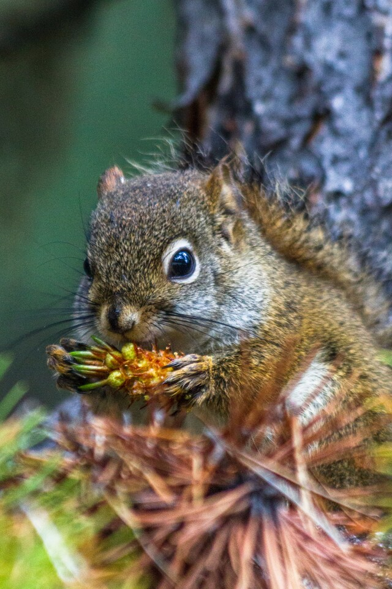

cd tresor_shell

./generer_probleme.py 16377
mkdir indices_sauvgarde

cat indices/12345/indice 

cp indices/12345/indice indices_sauvgarde/indice2
### Indice 2 : panorama ###
cd /usr 
ls -l |wc -l 
13# on trouvé 13 cela corespond a 12 sous repertoire + lui meme 
cd ~/tresor_shell 
./indice_suivant.py 3 12
28983 # l'enplacement du prochain indice qui est indices/28983
cp indices/28983/indice indices_sauvgarde/indice3
#indice  3
hostname # il m'a renvoye armstrong qui le nom du l'ordi
./indice_suivant.py 4 armstrong

72308
 cp indices/72308/indice indices_sauvgarde/indice4
#indice 4
man mv #pour lire le manuel de la commande mv 
-n pour eviter l'ecrasement 
./indice_suivant.py 5 -n       

90260
cp indices/90260/indice indices_sauvgarde/indice5
#indice5
cd  /comptes/a/as112323/tresor_shell
ls -al
 cd .cachette 
 cat .baobab 
616464

 cd ~/tresor_shell 
./indice_suivant.py 6 616464

23500
cp indices/23500/indice indices_sauvgarde/indice6
#INDICE 6

echo $PATH

/users/etudiant/a/as112323/bin:/usr/local/bin:/bin:/usr/bin:/usr/bin/X11:.

./indice_suivant.py 7 /users/etudiant/a/as112323/bin
02759

cp indices/02759/indice indices_sauvgarde/indice7
# indice 7
cd images
tail -n 5 ecureuil.jpg:
 le messge affiche :
 La courbe de tes yeux fait le tour de mon coeur
Un rond de danse et de douceur
Auréole du temps, berceau nocturne et sûr
Et si je ne sais plus tout ce que j’ai vécu
C’est que tes yeux ne m’ont pas toujours vu

 
cd ..

./indice_suivant.py 8 coeur douceur sûr vécu vu
43864

cp indices/43864/indice indices_sauvgarde/indice8
AFFICHAGE DU CONTENU DE L'INDICE 9

# INDICE 8

touch toutpuissant.txt                         
 echo " Je veux utiliser sudo.">>toutpuissant.txt 
 echo"AS">>toutpuissant.txt 
 
 sudo mv toutpuissant.txt /usr/local

il me demande le mot de pass du coup l'indication est impossible 

./indice_suivant.py 9 impossible 
45843

cp indices/45843/indice indices_sauvgarde/indice9

#indice 9

ou Cherche a trouvé indice 10

 ls /usr/share/dict/
 wc -w ~/usr/share/dict/words
 la commande nous retoutrne le nbr de mots dans le dictionaire :102401

./indice_suivant.py 10 102401

cp indices/97027/indice indices_sauvgarde/indice10

#indice 10

grep -B 1 koala /usr/share/dict/words 

le mot qu'on cherche ici c'est knuckling c'est elle qui apparait avant koala 

./indice_suivant.py 11 knuckling

80484 #l'emplacement de notre prochain indice 

cp indices/80484/indice indices_sauvgarde/indice11

#indice 11

ls -la /bin/ | sort -r #affichage de la liste des fichiers triés selon leur taille et la commande sort -r est l'option recherché

./indice_suivant.py 12 -r
20276

cp indices/20276/indice indices_sauvgarde/indice12

#indice 12

find . -size -1452c # elle renvoie  ./indices/64857/indice
cat indices/64857/indice

cp indices/64857/indice indices_sauvegarde/indice13

/                                         \
|          🎉 Félicitations ! 🥳           |
\                                         /
 ----------------------------------------- 
  \                           .       .
   \                         / `.   .' " 
    \                .---.  <    > <    >  .---.
     \               |    \  \ - ~ ~ - /  /    |
         _____          ..-~             ~-..-~
        |     |   \~~~\.'                    `./~~~/
       ---------   \__/                        \__/
      .'  O    \     /               /       \  " 
     (_____,    `._.'               |         }  \/~~~/
      `----.          /       }     |        /    \__/
            `-.      |       /      |       /      `. ,~~|
                ~-.__|      /_ - ~ ^|      /- _      `..-'   
                     |     /        |     /     ~-.     `-. _  _  _
                     |_____|        |_____|         ~ - . _ _ _ _ _>

